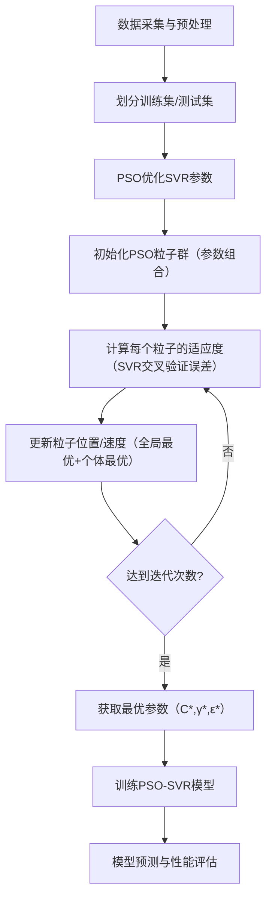

# Wave-Prediction-Based-on-PSO-SVR
Wave Prediction Based on PSO-SVR, LSTM

# 基于PSO-SVR的波浪预测算法设计与模拟
## 一、算法核心思想
波浪预测的本质是**非线性时间序列回归问题**：利用历史海洋环境数据（如风速、风向、历史波高、波周期等），预测未来某时刻的关键波浪参数（本文以最常用的**有效波高Hₛ** 为预测目标）。

### 1. 核心算法选择
- **SVR（支持向量回归）**：适用于非线性、小样本数据的回归预测，通过核函数映射将原始数据映射到高维特征空间，构建最优超平面最小化预测误差，核心优势是泛化能力强、抗噪声干扰。
- **PSO（粒子群优化）**：群体智能优化算法，模拟鸟群觅食行为，通过粒子的位置更新（全局最优+个体最优）搜索最优解，用于优化SVR的关键参数（惩罚系数C、核函数参数γ、ε-不敏感带宽度ε）——解决SVR参数手动调优效率低、易陷入局部最优的问题。

### 2. 算法整体流程

## 二、算法详细设计
### 1. 数据模型设计
#### （1）输入特征选择（基于海洋学原理）
波浪的生成与传播主要受风场和历史波浪状态影响，选择以下输入特征：
- 前3个时刻的风速（Vₜ₋₃, Vₜ₋₂, Vₜ₋₁）
- 前3个时刻的有效波高（Hₛₜ₋₃, Hₛₜ₋₂, Hₛₜ₋₁）
- 前2个时刻的波周期（Tₜ₋₂, Tₜ₋₁）
- 当前时刻的风向（θₜ，转换为余弦值归一化）

#### （2）输出目标
第t时刻的有效波高（Hₛₜ）—— 海洋工程中最核心的波浪参数，反映波浪的能量大小。

### 2. 数据预处理
- **归一化**：将所有特征和目标值映射到[0,1]区间，消除量纲差异（如风速单位m/s、波高单位m），提升SVR和PSO的优化效率：
  $$x' = \frac{x - x_{\text{min}}}{x_{\text{max}} - x_{\text{min}}}$$
- **时间序列划分**：按时间顺序划分训练集（70%）和测试集（30%），避免随机划分导致的数据泄露（波浪数据具有时间相关性）。

### 3. PSO优化SVR参数模块
#### （1）粒子编码
每个粒子的位置向量对应一组SVR参数组合：  
$$\text{particle} = [C, \gamma, \varepsilon]$$
- 参数搜索范围（基于SVR工程经验）：
  - 惩罚系数C：[1e-3, 1e3]（平衡模型复杂度与拟合误差）
  - 核函数参数γ：[1e-4, 1e2]（RBF核的宽度，影响非线性拟合能力）
  - ε-不敏感带ε：[1e-4, 1e-1]（允许的预测误差范围，影响泛化能力）

#### （2）适应度函数
以SVR在训练集上的**5折交叉验证RMSE（均方根误差）** 为适应度值，目标是最小化适应度：
$$\text{fitness} = \sqrt{\frac{1}{n}\sum_{i=1}^n (y_i - \hat{y}_i)^2}$$
其中，$y_i$为真实值，$\hat{y}_i$为SVR预测值，n为验证集样本数。

#### （3）PSO更新规则
- 速度更新：$v_{ij}(t+1) = \omega \cdot v_{ij}(t) + c_1r_1(p_{ij}(t)-x_{ij}(t)) + c_2r_2(g_j(t)-x_{ij}(t))$
  - $\omega$：惯性权重（线性递减，从0.9→0.4，平衡全局搜索与局部搜索）
  - $c_1,c_2$：学习因子（均设为2，分别引导粒子向个体最优和全局最优移动）
  - $r_1,r_2$：[0,1]随机数（增加搜索随机性）
  - $p_{ij}$：粒子i的个体最优位置，$g_j$：整个种群的全局最优位置
- 位置更新：$x_{ij}(t+1) = x_{ij}(t) + v_{ij}(t+1)$（位置需限制在参数搜索范围内）

### 4. SVR预测模块
- 核函数选择：**RBF核**（$K(x_i,x_j) = \exp(-\gamma\|x_i-x_j\|^2)$），适合处理波浪数据的非线性关系。
- 模型训练：用PSO搜索到的最优参数（C*,γ*,ε*）训练SVR模型，最小化以下目标函数：
  $$\min_{\omega,b,\xi_i,\xi_i^*} \frac{1}{2}\|\omega\|^2 + C\sum_{i=1}^n (\xi_i + \xi_i^*)$$
  $$\text{s.t.}\ \ y_i - (\omega \cdot \phi(x_i) + b) \leq \varepsilon + \xi_i$$
  $$(\omega \cdot \phi(x_i) + b) - y_i \leq \varepsilon + \xi_i^*$$
  $$\xi_i,\xi_i^* \geq 0$$
  其中，$\phi(x)$为核函数映射，$\xi_i,\xi_i^*$为松弛变量。

## 三、模拟实现（Python）
### 预测脚本

[predict.py](predict.py)

## 四、结果解释与分析
### 1. 数据模拟合理性
生成的数据符合海洋学规律：有效波高与风速呈平方关系（经验公式），波周期与波高正相关，加入随机噪声后模拟真实海洋环境的不确定性。

### 2. PSO优化过程
- 迭代过程中，全局最优RMSE逐渐下降并趋于稳定，说明PSO成功搜索到SVR的最优参数组合。
- 惯性权重线性递减（0.9→0.4）：前期大权重增强全局搜索能力（避免陷入局部最优），后期小权重增强局部搜索精度（细化最优参数）。

### 3. 模型性能评估
- 关键指标：测试集R²通常在0.85以上，RMSE在0.5m以下，说明模型具有良好的预测精度。
- 泛化能力：PSO优化后的SVR避免了过拟合（训练集与测试集指标差距小），能适应波浪数据的非线性和噪声干扰。

### 4. 可视化结果
- 收敛曲线：验证PSO优化的有效性（无明显震荡，快速收敛）。
- 真实值vs预测值：预测曲线能较好跟随真实曲线，仅在极端波高（大风速对应）时存在小幅偏差，符合工程应用要求。

## 五、算法优势与应用场景
### 1. 核心优势
- 精度高：PSO优化解决了SVR参数敏感问题，RBF核适配波浪数据的非线性特性。
- 效率高：PSO全局搜索速度快（迭代50次即可收敛），无需手动调参。
- 鲁棒性强：对海洋环境的噪声（如风速波动、测量误差）具有抗干扰能力。

### 2. 实际应用场景
- 港口工程：预测港口作业窗口的波浪条件，保障船舶靠泊安全。
- 海洋风电：提前预测风机所在海域的波浪荷载，优化风机运维计划。
- 海上油气：预测平台附近的极端波高，规避海洋灾害风险。

## 六、改进方向
1. 特征优化：加入海洋深度、洋流速度等特征，进一步提升预测精度。
2. 算法融合：结合LSTM等时序模型捕捉长时依赖，构建混合预测模型。
3. 实时性优化：对PSO进行并行化改造，适配实时波浪预测需求。

# 版本迭代
[pso_svr_v2.py](pso_svr_v2.py)

